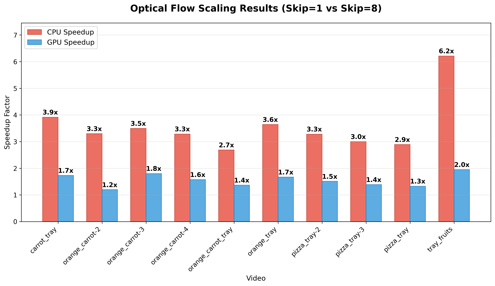
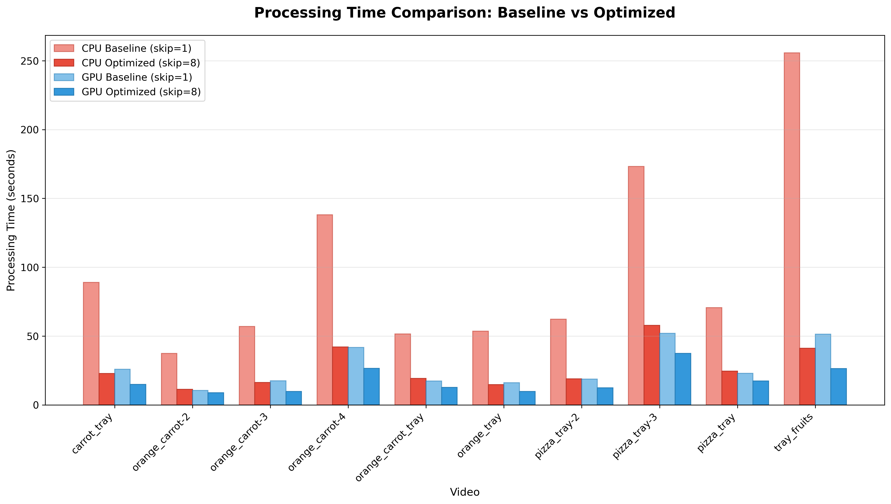

# Food Tray Detection: Scaling with Optical Flow


## Overview

This project scales a YOLO-based food tray detection system from static image processing to real-time video streams using Lucas-Kanade optical flow optimization.

**Models:**

- **Tray Detector**: Fine-tuned YOLO model for cafeteria trays

- **Food Detector**: YOLO11n with food classes (banana, apple, sandwich, pizza, etc.)

## Scaling Challenge

**Problem**: YOLO inference on every video frame is computationally expensive

- Baseline: 255+ seconds for a single video on CPU
- Future deployment: GPU server processing multiple client camera streams
- Need: Real-time processing for concurrent video streams

**Solution**: Lucas-Kanade optical flow for intelligent frame skipping

- Run YOLO detection every N frames
- Track objects between detection frames using optical flow
- Configurable skip_frames parameter for speed/accuracy trade-off
- Optimizes server resources for multi-client video processing

## Results

### Performance Improvements (skip=1 → skip=8)
<div>
  
  
</div>

<br>

**Key Findings:**

- **Maximum CPU speedup**: 6.2x (tray_fruits.mp4)
- **Average CPU improvement**: 3.4x across all videos
- **GPU optimization**: 1.4-1.9x speedup, enabling multi-stream processing
- **Optimal configuration**: Skip=8 provides best balance between speed and accuracy for real-time deployment


## Usage

### Benchmarking
```bash
python benchmark_optical_flow.py \
  --video-dir ./videos/benchmark-input \
  --skips 1 3 5 8 12 16 \
  --csv benchmark_results.csv
```

### Real-Time Detection
```bash
# Basic webcam detection with optical flow optimization
python stream_detector.py --mode webcam --skip-frames 8

# Save the detection output video
python stream_detector.py --mode webcam --skip-frames 8 --save-display --video-out ./demo-videos/demo.mp4

# Process RTMP stream with logging
python stream_detector.py --mode stream --stream-url rtmp://my-stream --skip-frames 8 --save-log --log-out detections.log

# Verbose output mode (print detections to console)
python stream_detector.py --mode webcam --skip-frames 8 --output-mode verbose
```


## Repository Structure

```
├── utils/
│   ├── detect.py          # Detection and optical flow tracking functions
│   └── bbox.py            # Bounding box utilities
├── demo-videos/           # Real-time detection demo recordings
├── sources/               # Generated graphs and visualization assets
├── benchmark_optical_flow.py  # Performance benchmarking script
├── stream_detector.py     # Real-time streaming detection
├── cpu_benchmark_results.csv  # CPU benchmark results
├── gpu_benchmark_results.csv  # GPU benchmark results
└── README.md
```

## Trade-offs

- **skip=1**: No optimization, highest accuracy, slowest performance
- **skip=8**: Optimal balance - significant speedup with minimal accuracy loss  
- **skip=16**: Maximum speedup but potential tracking drift, especially if the cam isn't fixed.

The 3-6x CPU performance improvement enables real-time food monitoring on standard hardware without requiring GPU acceleration.